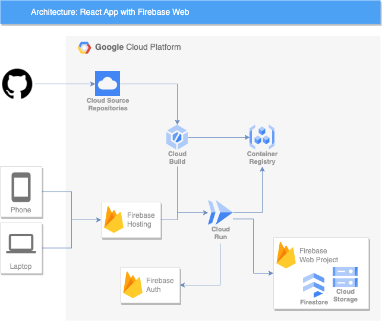

# Tourest app
> A reference project to deploy a React app onto Google Cloud Run, Cloud Build as the CI/CD tool, and Cloud Firebase Web for authentication, storage, database, hosting.

**Read more:** [medium.com/google-cloud](https://medium.com/google-cloud/getting-started-react-app-with-firebase-web-and-cloud-run-in-gcp-3299bf1c92e0)



## Prerequisites :heavy_exclamation_mark:
- Google Cloud Project with a configured billing account
- Terraform
- Project repository on Cloud Source Repositories

## Deploy :hammer:
Run the script for deploying an application to a cloud project via terraform.
```shell
 ./init.sh
```

## Run locally :low_brightness:
1. Run `terraform output` to print Firebase resources URL/IDs
2. Update .env with the associated Firebase resources URL/IDs
3. Run npm run start and visit app at http://localhost:3000:
```shell
npm install
npm start
```
